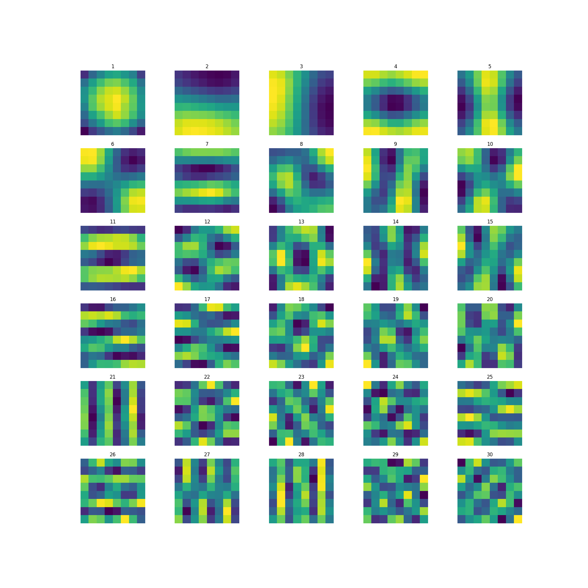
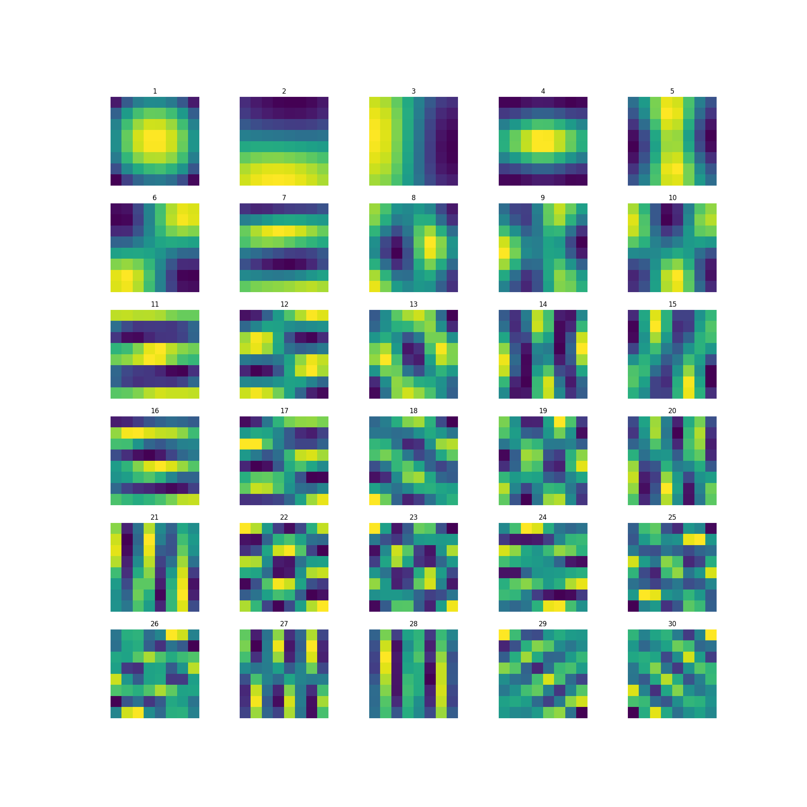
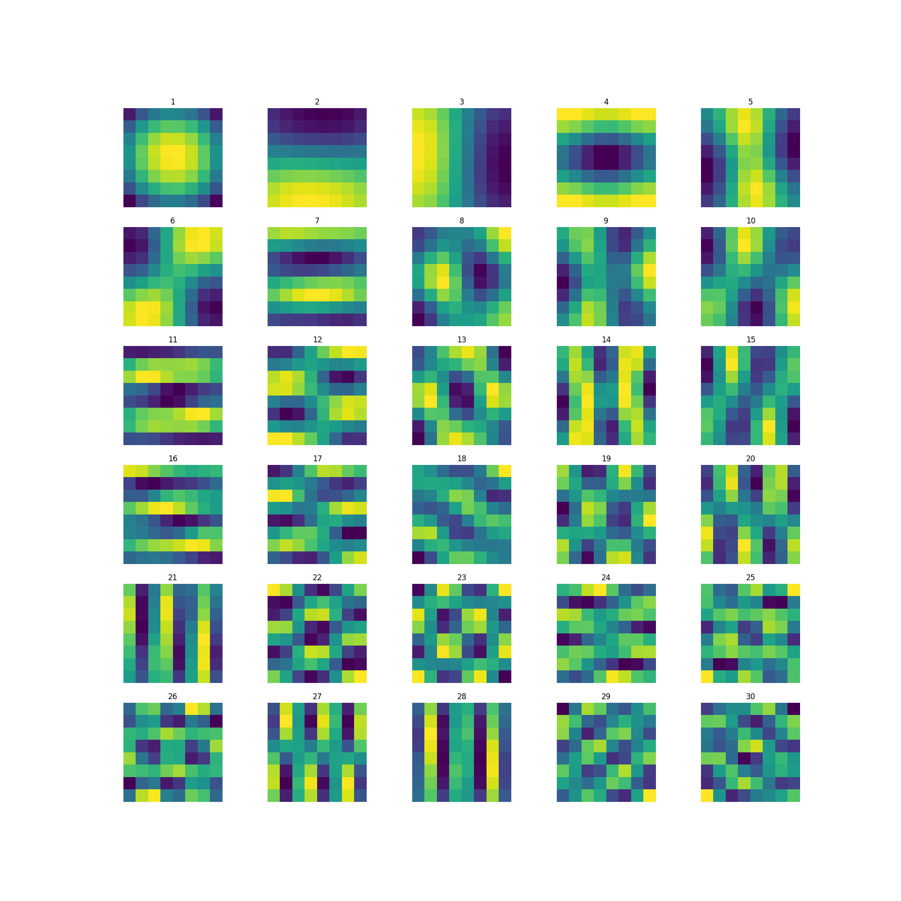
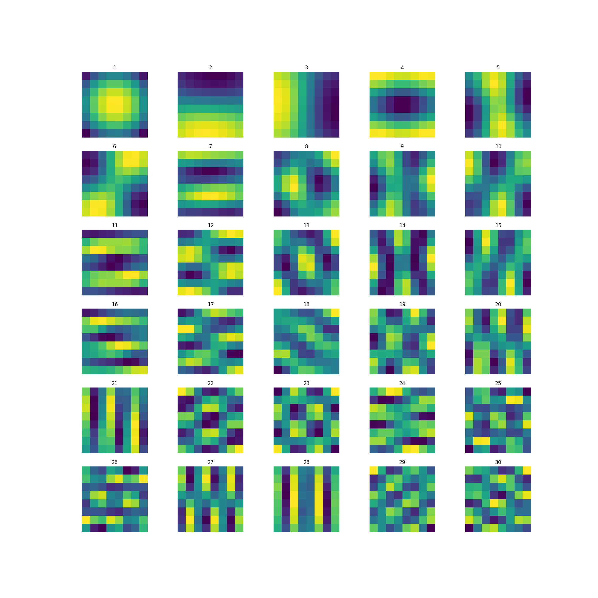
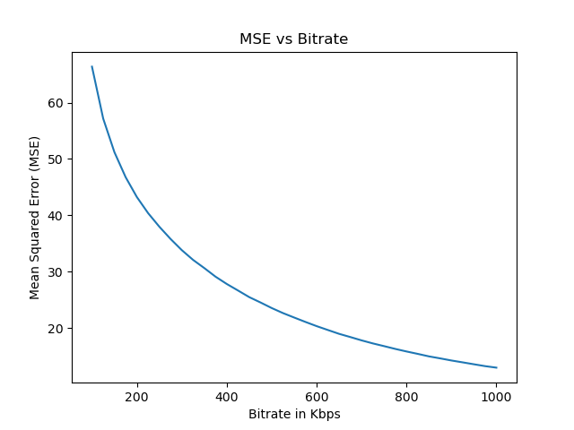
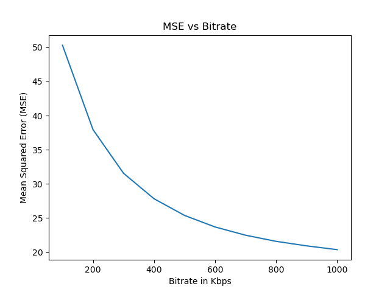
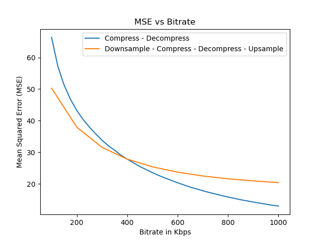

  [![Contributors][contributors-shield]][contributors-url] [![Forks][forks-shield]][forks-url] [![Stargazers][stars-shield]][stars-url] [![Issues][issues-shield]][issues-url] [![MIT License][license-shield]][license-url] [![LinkedIn][linkedin-shield]][linkedin-url]

<!-- PROJECT LOGO -->
<br />

<p align="center">
  <h3 align="center">Video Compression and PCA</h3>
  <p align="center">
    Intermediate frame interpolation using optical flow with FlowNet2
    <br />
    <a href=https://github.com/vineeths96/Video-Compression-and-PCA><strong>Explore the repository»</strong></a>
    <br />
    <br />
    <a href=https://github.com/vineeths96/Video-Compression-and-PCA/blob/master/Problem_Statement.pdf>View Problem Statement</a>
    <a href=https://github.com/vineeths96/Video-Compression-and-PCA/blob/master/results/report.pdf>View Report</a>
  </p>


</p>

> tags : video compression, image compression, adaptive bitrate, natural images, pca, ffmpeg, digital video


<!-- ABOUT THE PROJECT -->

## About The Project

This project deals with the task of calculating the principal components of natural images and video frame compression. In the first task, we extract a large number of patches from natural images of the [Berkeley segmentation](https://www2.eecs.berkeley.edu/Research/Projects/CS/vision/bsds/) dataset and visualize the principal components as images. In the second task we try to understand the bit rate below which it is better to downsample the video spatially by 2, compress the video and then upsample rather directly compress at the desired bit rate. A detailed description and analysis of the results are available in the [Report](./results/report.pdf).

### Built With
This project was built with 

* python v3.8
* The environment used for developing this project is available at [environment.yml](environment.yml).


<!-- GETTING STARTED -->

## Getting Started

Clone the repository into a local machine using

```shell
git clone https://github.com/vineeths96/Video-Compression-and-PCA
```

### Prerequisites

Create a new conda environment and install all the libraries by running the following command

```shell
conda env create -f environment.yml
```

The dataset used in this project will be automatically downloaded to the `input/` folder. To test on other datasets, download them and put them in the `input/` folder.

### Instructions to run

##### Principal components of natural images

To find and plot the principal components of natural images run the following command. Set the parameters for patch extraction in the [parameters](./image_pca/parameters.py) file. This will generate the images and store it in [this](./results/natural_image_pca) folder.

```shell
python natural_image_pca.py
```

##### Image compression and Resolution

To find the bit rate below which it is better to downsample the video spatially by 2, compress
the video and then upsample rather directly compress at the desired bit rate, run the following command. Set the parameters for this experiment in the [parameters](./image_compression/parameters.py) file. This will compress the video using H.264 with ffmpeg and store the frames and video in [this](./results/image_compression_and_resolution) folder.

```shell
python image_compression.py
```


<!-- RESULTS -->

## Results

A detailed description of methods and analysis of the results are available in the [Report](./results/report.pdf).

We extract 8 × 8 patches from each of these images and perform Principal Component Analysis (PCA) on the patches. We visualize the principal components as images with different number of patches per image. As we would expect, the higher the number of patches, better the results are. We observe that the results closely agrees with the current literature.

|              100 Patches per Image              |             1000 Patches per Image              |
| :---------------------------------------------: | :---------------------------------------------: |
|      |     |
|           **10000 Patches per Image**           |           **25000 Patches per Image**           |
|  |  |


We find the bit rate switching for a given video. We measure the quality in terms of mean squared error in the luminance between the original frame and reconstructed frame. Clearly, we can see that there is a switching between the two methods. The switching bit rate is around 400 Kbps — above which compression-decompression in original dimensions is better and below which downsampling - compression - decompression - upsampling is better.


|                    Compress - Decompress                     |        Downsample - Compress - Decompress - Upsample         |
| :----------------------------------------------------------: | :----------------------------------------------------------: |
|  |  |

|                         Comparision                          |
| :----------------------------------------------------------: |
|  |


<!-- LICENSE -->

## License

Distributed under the MIT License. See `LICENSE` for more information.


<!-- CONTACT -->
## Contact

Vineeth S - vs96codes@gmail.com

Project Link: [https://github.com/vineeths96/Video-Compression-and-PCA](https://github.com/vineeths96/Video-Compression-and-PCA)


<!-- MARKDOWN LINKS & IMAGES -->
<!-- https://www.markdownguide.org/basic-syntax/#reference-style-links -->

[contributors-shield]: https://img.shields.io/github/contributors/vineeths96/Video-Compression-and-PCA.svg?style=flat-square
[contributors-url]: https://github.com/vineeths96/Video-Compression-and-PCA/graphs/contributors
[forks-shield]: https://img.shields.io/github/forks/vineeths96/Video-Compression-and-PCA.svg?style=flat-square
[forks-url]: https://github.com/vineeths96/Video-Compression-and-PCA/network/members
[stars-shield]: https://img.shields.io/github/stars/vineeths96/Video-Compression-and-PCA.svg?style=flat-square
[stars-url]: https://github.com/vineeths96/Video-Compression-and-PCA/stargazers
[issues-shield]: https://img.shields.io/github/issues/vineeths96/Video-Compression-and-PCA.svg?style=flat-square
[issues-url]: https://github.com/vineeths96/Video-Compression-and-PCA/issues
[license-shield]: https://img.shields.io/badge/License-MIT-yellow.svg
[license-url]: https://github.com/vineeths96/Video-Compression-and-PCA/blob/master/LICENSE
[linkedin-shield]: https://img.shields.io/badge/-LinkedIn-black.svg?style=flat-square&logo=linkedin&colorB=555
[linkedin-url]: https://linkedin.com/in/vineeths

